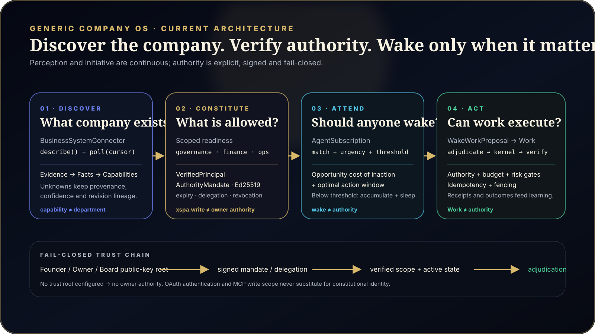

# XanxitoSpA — Current architecture state (2026-08-25)

This document is the concise source of truth for the architecture that is implemented today. Historical runtime notes remain useful as evolution records, but this file describes the current composition.

## Core thesis

XanxitoSpA models a company rather than a single agent. The runtime separates perception, attention, authority and execution so that an autonomous company can discover how an existing business works, maintain durable objectives while sleeping, wake when evidence warrants attention, and still fail closed when authority is absent.

The current top-level flow is:

```text
existing or new company
        ↓
discover systems and evidence
        ↓
infer facts / capabilities / unknowns
        ↓
ask evidence-driven questions
        ↓
readiness by scope
        ↓
verified constitutional / owner mandates
        ↓
organization + durable objectives
        ↓
continuous connector polling
        ↓
subscription + urgency
        ↓
wake proposal
        ↓
Work + adjudication
        ↓
kernel execution + verification
        ↓
outcome / receipt / learning / sleep
```



## 1. Company discovery

`GenericDiscoveryOrchestrator` adopts an existing company without assuming an industry-specific organization chart.

Discovery separates:

- `BusinessEvidence`: what was actually observed and where it came from;
- `BusinessFact`: observed, inferred or cryptographically owner-confirmed statements;
- `BusinessUnknown`: unresolved questions with explicit resolution requirements;
- `BusinessCapability`: business functions/capabilities inferred from evidence;
- `DiscoveryRevision`: immutable revision lineage with deterministic fingerprinting.

The important invariant is:

```text
capability ≠ department
```

The system discovers business capabilities first. Departments are a later organizational projection that preserves observed ownership/process structure before proposing missing coverage.

## 2. One connector, two modes

`BusinessSystemConnector` is the single external-system abstraction:

```ts
interface BusinessSystemConnector {
  id: string
  describe(): Promise<DiscoveredBusinessSystem>
  poll(cursor: SignalCursor): Promise<SignalPollResult>
}
```

`describe()` reads the shape of a system for discovery. `poll()` reads ongoing business events. This prevents discovery adapters and signal adapters from drifting into separate registries.

`CsvSignalSource` is the deterministic no-network reference implementation used to test replay, cursoring, wake logic and thresholds.

## 3. Readiness is scoped, not global

XanxitoSpA does not attempt to reach a fictional state where it understands an entire company forever. Discovery readiness is evaluated by scope, currently including:

- governance;
- commercial;
- finance;
- operations;
- organization.

A scope reports whether evidence is sufficient, which unknowns block it, and a confidence signal. This allows one process/domain to become operable while unrelated areas remain under discovery.

System existence never proves truth or authority. Detecting a ledger, for example, supplies candidate evidence and can lower question priority, but the question “is this the trusted and current financial source of truth?” remains open until the required confirmation exists.

## 4. Resolution requirements

`BusinessUnknown` carries one of four trust requirements:

```text
evidence
operator-confirmation
owner-confirmation
constitutional-mandate
```

Only `evidence` unknowns may close from system observation alone. Ordinary `xspa.write` access cannot create owner-confirmed facts or resolve owner/constitutional unknowns.

## 5. Verified owner / Founder authority

Authentication and constitutional authority are intentionally different systems:

```text
OAuth identity ≠ company ownership
xspa.write ≠ owner authority
```

The current authority root uses server-configured public-key trust anchors for Founder/Owner/Board principals. Private signing keys are never accepted through the ordinary MCP surface.

A signed `authority.mandate.1` envelope binds:

- company;
- issuer principal;
- subject;
- effect (`assert`, `delegate`, `revoke`);
- scopes;
- claims;
- constraints;
- issued/not-before/expiry timestamps;
- supersession/revocation references;
- canonical payload hash;
- Ed25519 signature and key id.

Verification fails closed on company mismatch, untrusted issuer, invalid signature/hash, invalid time window, insufficient scope, revocation or supersession.

Delegation is itself signed and scoped. A delegated public key becomes trusted only for the scopes granted by an active owner/root mandate; revoking or superseding that delegation removes derived authority without rewriting history.

Owner/constitutional discovery questions may be resolved only when an active verified mandate carries the corresponding scope. Resulting evidence retains `mandate:<id>` provenance.

### Production enrollment state

The mandate machinery is deployed, but the first real trust root is intentionally provisioned out of band through `XSPA_AUTHORITY_TRUST_ANCHORS_JSON`. When no real root is enrolled, production reports `trustConfigured=false` and applies no owner authority. This is a safety property, not an error fallback.

## 6. Perception and governed wake

The constitution projects durable objectives, signal sources and `AgentSubscription`s. Subscriptions match business events and calculate urgency using the first two DAWN-style components implemented in V1:

- opportunity cost of inaction;
- pressure from the optimal action window.

Below threshold, signal pressure accumulates durably and the company keeps sleeping. Above threshold, the runtime emits a `WakeWorkProposal`.

```text
wake ≠ Work
wake ≠ authority
```

Replay protection uses durable event/subscription accounting plus bounded defensive caching. The Company heartbeat lease remains the fencing/timing boundary, while each connector persists an independent opaque source cursor so one integration cannot advance or corrupt another integration's position.

## 7. Execution boundary

A wake proposal still cannot execute material work. The execution path remains:

```text
WakeWorkProposal
      ↓
Work
      ↓
Business Preflight
      ↓
authority + budget + risk adjudication
      ↓
mission graph / delegation
      ↓
capability execution
      ↓
verification
      ↓
BusinessOutcome + BusinessReceipt
```

Core invariants:

```text
observation ≠ truth
truth confirmation ≠ execution authority
wake ≠ authority
Work ≠ authority
mandate ≠ unlimited permission
```

## 8. MCP control surface

The remote ChatGPT MCP app now exposes the generic Company OS, discovery/wake and authority surfaces. Relevant current tools include:

```text
xspa_company_discovery_plan
xspa_company_discovery_apply
xspa_company_discovery_status
xspa_company_discovery_orchestrate

xspa_authority_mandate_verify
xspa_authority_mandate_apply
xspa_authority_mandate_status

xspa_company_wake_evaluate
xspa_company_wake_status

xspa_company_plan
xspa_company_apply
xspa_company_status
```

One deployment remains scoped to one Company. Callers cannot supply `company_id` to switch tenants.

## 9. External benchmark evidence

The external paired benchmark is maintained separately so its preregistration/history are independently inspectable:

- Public repository: <https://github.com/riquelmechile/xspa-theagentcompany-benchmark>
- v3: no directional capability difference detected in a small paired sample; this is not an equivalence result;
- v4: execution-integrity discovery campaign;
- v4/v5: historical deterministic integrity regression; preregistration chronology preserved, statistical-confirmation interpretation withdrawn after runner audit;
- v6: corrected competent-DIRECT design with common plan/oracle/fault, PostgreSQL durability and SUT commit pinning.

The historical v5 scripted output remains 8 XSPA wins, 0 DIRECT wins and 12 ties. Its preregistered sign-test calculation is preserved in the evidence repo, but it is no longer interpreted as inferential evidence because the audited suite is deterministic and some arms are asymmetric. V6 replaces that causal claim rather than rewriting the historical artifacts.

The stated limitation remains that DIRECT was not specifically prompted for resilience. The benchmark therefore supports the narrower claim that the XanxitoSpA kernel preserves execution integrity under the tested faults where direct execution did not, not that DIRECT represents the strongest possible resilience prompt.

## 10. Current verified repository state

At commit `a4dfe8e` the current signal-attestation/keyring-hardening state passed:

```text
TypeScript typecheck                 PASS
Unit/integration suite               111 PASS
Local PostgreSQL integration         1 skipped by local environment
Company Gym                          123/123 PASS
MCP Streamable HTTP smoke            PASS
ChatGPT app MCP smoke                PASS
OAuth resource-server smoke          PASS
PostgreSQL 18 CI smoke               PASS
4R review                            #408 approved
Exact-head CI                         PASS (`f6477c78b25f275e3fc510326bfdac37ed377fad`)
Exact-head GitHub Actions CI          PASS
```

The next architectural block remains the secure first-root enrollment ceremony: establish a real Founder/Owner public-key trust anchor without allowing ordinary `xspa.write` callers to create or replace the authority root. Kernel hardening from the external audit is shipped and exact-head CI is green.


### Kernel hardening — 2026-08-25

The heartbeat cursor is now persisted with the active lease owner/fencing token in the same database statement and cannot regress `(occurred_at, event_id)`. `company_assets` carry optimistic versions; governed wake state uses compare-and-swap and rechecks the heartbeat lease immediately before persistence. Manual MCP wake input is `asserted` and cannot impersonate an observed connector event; routing uses attested event metadata and urgency policy is kernel-owned rather than payload-owned. Accumulation uses exponential decay instead of a hard reset, while replay protection is not erased by the accumulation window.

Signed discovery-resolution mandates bind to an exact discovery revision ID + fingerprint. Runtime mandate history is protected by a durable count/hash ledger head and fails closed on mismatch. Historical public keys remain available for verification within their issuance validity window; key rotation does not authorize post-retirement issuance.

The MCP remains the control boundary and defaults to loopback. Broader deployment binding requires explicit configuration and DNS host allowlisting. No model-provider API was introduced by this hardening work; the host model law remains GPT-5.6 Sol under Xanxito control.


## Attention-plane status

`xspa_company_wake_evaluate` is intentionally diagnostic-only: MCP-supplied events are asserted and cannot satisfy observed-only subscriptions. `BusinessSystemConnector.poll()` returns `RawBusinessEvent[]`, where trusted `signal` provenance is type-forbidden. `pollObservedBusinessSystem()` is the only attestation boundary that converts raw connector output into `ObservedBusinessEvent[]` with deterministic attestation references and declared-capability checks. `GovernedObservedSignalScheduler` durably claims `observedSignalIdempotencyKey(event)` before wake evaluation and advances a dedicated Company+source `SignalCursor` only under the current heartbeat fencing token and only after successful settlement; unknown/reconciliation blocks cursor advancement. `BusinessSystemConnectorRegistry` and `GovernedObservedSignalDaemon` provide deterministic enabled-connector polling and safe restart from those durable cursors. Trusted runtime bootstrap may now register read-only CSV connectors from `XSPA_BUSINESS_SYSTEM_CONNECTORS_JSON`; each path is relative to and confined beneath `XSPA_SIGNAL_ROOT`, and secret-bearing config, traversal, unknown transports or missing runtime state fail closed. Ordinary MCP input still cannot register connectors or mint observed provenance, and this polling loop makes zero model-provider calls.

Wake replay state now uses a time retention watermark (`replayRetentionSeconds`) plus per-key observation timestamps. Durable runtime idempotency remains the authoritative replay ledger; the JSONB wake state is compacted by age rather than by a fixed last-N slice.

Authority trust-anchor configuration supports a historical keyring: multiple key IDs for the same principal may coexist with `validFrom`/`validUntil` issuance windows. Retired public keys must remain in the configured keyring for historical verification; issuance after `validUntil` fails closed. New mandate application also persists a `company-authority-keyring-head` containing a deterministic count/hash and public-key fingerprints. Runtime verification rejects a missing or modified historical root with `AUTHORITY_KEYRING_INCOMPLETE`, including a migration backstop that derives required non-delegated signer identities from the mandate ledger.


## External benchmark V7

The corrected post-audit V7 benchmark froze a complete executable three-scenario campaign before outcomes against XanxitoSpA `92ac8a12babb8245c4cfd621ecaac487e904409d`. It then executed once unchanged. DIRECT passed 0/3 shared mechanism oracles; XANXITOSPA passed 3/3 on ABA stale idempotency settlement, ABA stale heartbeat cursor regression, and write-permission-without-owner-credential. This is deterministic mechanism evidence only: no sampling p-value and no claim that the full Company OS is causally necessary for all three outcomes.
